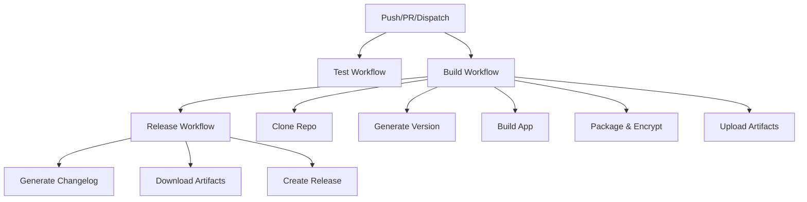

# GitHub Actions 工作流说明

本项目采用模块化的 GitHub Actions 工作流设计，遵循单一职责原则，便于维护和复用。

## 📁 目录结构

```
.github/
├── actions/                    # 可重用的复合动作
│   ├── clone-private-repo/     # 克隆私有仓库
│   ├── generate-version/       # 生成版本号
│   ├── build-app/             # 构建应用程序
│   ├── package-encrypt/        # 打包和加密
│   └── generate-changelog/     # 生成变更日志
├── workflows/                  # 工作流文件
│   ├── build.yml              # 构建工作流
│   ├── release.yml            # 发布工作流
│   ├── test.yml               # 测试工作流
│   └── build-and-release-pipeline.yml  # 主管道工作流
└── README.md                  # 本文档
```

## 🔧 工作流说明

### 1. 主管道工作流 (`build-and-release-pipeline.yml`)
- **用途**: 协调构建和发布流程
- **触发**: push、workflow_dispatch、repository_dispatch
- **职责**: 调用构建和发布工作流

### 2. 构建工作流 (`build.yml`)
- **用途**: 构建多平台应用程序
- **触发**: 被主管道调用，或独立触发
- **职责**: 
  - 克隆私有仓库
  - 生成版本号
  - 构建应用程序
  - 打包和加密
  - 上传构建产物

### 3. 发布工作流 (`release.yml`)
- **用途**: 创建 GitHub Release
- **触发**: 构建完成后，或独立触发
- **职责**:
  - 生成变更日志
  - 下载构建产物
  - 创建 GitHub Release

### 4. 测试工作流 (`test.yml`)
- **用途**: 运行代码测试和 lint
- **触发**: PR、push
- **职责**: 
  - 代码检查
  - 运行测试

## 🧩 复合动作说明

### 1. `clone-private-repo`
- **用途**: 克隆私有仓库
- **输入**: repository-url, github-token, target-directory
- **输出**: repo-path

### 2. `generate-version`
- **用途**: 根据触发类型生成版本号
- **输入**: app-directory
- **输出**: version, is-prerelease, private-commit, private-commit-short

### 3. `build-app`
- **用途**: 构建应用程序
- **输入**: app-directory, executable-name, platform
- **输出**: 无

### 4. `package-encrypt`
- **用途**: 打包并加密构建产物
- **输入**: app-directory, executable-name, version, artifact-name, encryption-password, platform
- **输出**: package-name

### 5. `generate-changelog`
- **用途**: 生成变更日志
- **输入**: app-directory, version, commit-count, branches
- **输出**: changelog

## 📋 配置参数

### 环境变量
- `CHANGELOG_COMMIT_COUNT`: 每个分支显示的提交数量 (默认: 10)
- `CHANGELOG_BRANCHES`: 要显示的分支列表 (默认: "dev,main")
- `ARTIFACT_RETENTION_DAYS`: 构建产物保留天数 (默认: 30)

### Secrets
- `REPOSITORY_URL`: 私有仓库 URL
- `SELF_GITHUB_SECRETS`: GitHub 访问令牌
- `COMPRESSED_PASSWORD`: 7z 加密密码
- `GITHUB_TOKEN`: GitHub 操作令牌 (自动提供)

## 🚀 使用方式

### 自动触发
1. **推送到 main/dev 分支**: 自动触发构建和发布
2. **创建标签**: 触发正式版本发布
3. **Repository Dispatch**: 远程触发构建

### 手动触发
1. 在 Actions 页面选择对应的工作流
2. 点击 "Run workflow" 按钮
3. 选择分支并执行

## 🔄 工作流程



## 🎯 优势

1. **单一职责**: 每个工作流和动作都有明确的职责
2. **可重用性**: 复合动作可以在多个工作流中重用
3. **可维护性**: 模块化设计便于维护和更新
4. **可测试性**: 可以独立测试每个组件
5. **灵活性**: 可以独立运行任何工作流
6. **可扩展性**: 易于添加新的功能和平台支持

## 🔧 自定义配置

### 添加新平台
1. 在 `build.yml` 的 matrix 中添加新的操作系统
2. 在 `build-app` 动作中添加平台特定的处理逻辑

### 修改版本策略
1. 编辑 `generate-version` 动作
2. 调整版本生成逻辑

### 自定义变更日志
1. 编辑 `generate-changelog` 动作
2. 修改分支和提交展示逻辑

## 🐛 故障排除

### 常见问题
1. **构建失败**: 检查私有仓库访问权限和依赖
2. **发布失败**: 检查 GITHUB_TOKEN 权限
3. **加密失败**: 检查 COMPRESSED_PASSWORD 设置
4. **版本重复**: 检查版本生成逻辑和标签创建

### 调试技巧
1. 启用工作流的调试日志
2. 检查各步骤的输出
3. 使用 workflow_dispatch 手动测试
4. 查看 Actions 页面的详细日志
